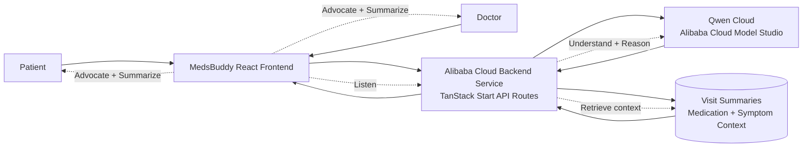

# MedsBuddy AI

MedsBuddy AI is a Qwen Cloud-powered AI patient advocate for doctor visits. With patient consent, it listens to the visit, understands patient and doctor intent, retrieves relevant patient history and medication context, speaks up when clarification is needed, and automatically generates structured visit documentation, follow-up actions, and plain-language summaries.

## Qwen Cloud Hackathon Submission

- **Track:** Track 4: Autopilot Agent
- **Title:** MedsBuddy: AI Patient Advocate for Doctor Visits
- **Agent loop:** Listen -> Understand -> Reason -> Retrieve patient information -> Help the doctor -> Summarize
- **Primary workflow:** Doctor Visit / AI Patient Advocate mode

See `docs/DEVPOST_SUBMISSION.md` for the copy-paste Devpost pitch, demo video script, judging map, and submission checklist.

## Judging and Testing Links

- **Public repository:** `https://github.com/dande10/medsbuddy-ai`
- **License:** MIT, included at `LICENSE`
- **Architecture diagram:** `docs/architecture-diagram.pdf`, `docs/architecture.mmd`, and the in-app `/architecture` route
- **Deployment proof guide:** `docs/ALIBABA_ECS_FASTAPI_DEPLOYMENT.md`
- **Qwen / Alibaba proof guide:** `docs/HACKATHON_QWEN_CLOUD_PROOF.md`

Recommended demo flow: use the Talk page to prepare a sore-throat visit, approve the pre-visit summary, run the Doctor Visit AI Patient Advocate flow, show MedsBuddy answering doctor questions, show MedsBuddy asking for missing follow-up and warning signs after an Amoxicillin care plan, then show the structured visit summary.

Alibaba Cloud proof endpoints to screenshot:

```txt
http://YOUR_ECS_PUBLIC_IP/health
http://YOUR_ECS_PUBLIC_IP/api/qwen-proof
```

Vercel production note: do not expose an HTTP ECS IP through `VITE_MEDSBUDDY_API_BASE_URL`.
The browser app runs on HTTPS, so direct `https://vercel.app -> http://ECS_IP` calls are blocked
as mixed content. For Vercel, set the server-only proxy variable instead:

```txt
MEDSBUDDY_API_BASE_URL=http://YOUR_ECS_PUBLIC_IP
VITE_MEDSBUDDY_API_BASE_URL=
```

The Vercel app calls same-origin HTTPS routes such as `/api/medsbuddy/agent-router`, and those
server routes forward to Alibaba ECS.

## Hackathon Architecture



The same diagram is available as `docs/architecture-diagram.pdf` for upload, with editable Mermaid source in `docs/architecture.mmd`.

## Qwen Cloud Integration

The app no longer uses Featherless AI. All AI chat calls now go through the backend client in `src/lib/qwen-cloud.ts`, which calls the Qwen Cloud OpenAI-compatible chat completions API.

Important proof files:

- `src/lib/qwen-cloud.ts` - Qwen Cloud API client.
- `src/lib/ai-chat.functions.ts` - MedsBuddy AI server function using Qwen Cloud.
- `src/routes/api/qwen-proof.ts` - backend proof endpoint for judges.
- `docs/HACKATHON_QWEN_CLOUD_PROOF.md` - copy-pasteable proof call and request shape.

## Alibaba ECS Backend Proof for Devpost

For the Qwen Cloud Hackathon, MedsBuddy includes a deployable Alibaba Cloud ECS backend in `backend/`.
The backend runs FastAPI behind Nginx and systemd, stores patient-approved visit memory in SQLite, and sends all live visit reasoning requests to Qwen Cloud from the server.

Architecture:

```txt
MedsBuddy App -> Alibaba ECS Backend APIs -> Qwen Cloud -> Visit Memory DB -> Response
```

MedsBuddy ECS endpoints:

- `POST /api/medsbuddy/analyze-transcript` - Qwen detects speaker, intent, and whether MedsBuddy should respond.
- `POST /api/medsbuddy/generate-summary` - Qwen creates the structured visit summary.
- `POST /api/medsbuddy/save-memory` - saves patient-approved doctor visit memory.
- `GET /api/medsbuddy/memory/{patientId}` - retrieves approved previous visit memories.
- `POST /api/medsbuddy/ask-memory` - retrieves memory and asks Qwen to answer doctor questions.
- `POST /api/medsbuddy/clarification-check` - Qwen decides whether MedsBuddy should ask a clarification.
- `POST /api/medsbuddy/chat` - general MedsBuddy chat reasoning for the Talk page.

Backend logs include:

- `Alibaba ECS API called`
- `Calling Qwen Cloud`
- `Visit memory saved`
- `Visit memory retrieved`

ElevenLabs voice support is available through backend endpoints:

- `POST /api/stt`
- `POST /api/tts`

Deployment guide and curl proof commands:

- `docs/ALIBABA_ECS_FASTAPI_DEPLOYMENT.md`

## Environment Variables

Copy `.env.example` to `.env.local` for local development:

```bash
cp .env.example .env.local
```

Set at least one Qwen/DashScope API key variable:

```bash
QWEN_API_KEY=your_qwen_cloud_key
# or
DASHSCOPE_API_KEY=your_dashscope_key
```

Supported variables:

| Variable                      | Required         | Description                                                                                                                                             |
| ----------------------------- | ---------------- | ------------------------------------------------------------------------------------------------------------------------------------------------------- |
| `QWEN_API_KEY`                | Yes              | Qwen Cloud API key. `DASHSCOPE_API_KEY` also works.                                                                                                     |
| `DASHSCOPE_API_KEY`           | Yes, alternative | DashScope API key alias.                                                                                                                                |
| `QWEN_MODEL`                  | No               | Defaults to `qwen-plus`.                                                                                                                                |
| `QWEN_CHAT_MODEL`             | No               | Fast model for the Talk page. Defaults to `qwen-plus`; keep `QWEN_MODEL` for deeper doctor-visit reasoning.                                             |
| `QWEN_API_BASE_URL`           | No               | Defaults to `https://dashscope-intl.aliyuncs.com/compatible-mode/v1`. Change this if your Alibaba Cloud account uses another DashScope region endpoint. |
| `MEDSBUDDY_API_BASE_URL`      | Vercel proxy     | Server-only Alibaba ECS backend URL, for example `http://YOUR_ECS_IP`. Use this on Vercel so the browser calls same-origin HTTPS proxy routes.          |
| `VITE_MEDSBUDDY_API_BASE_URL` | Local/HTTPS only | Browser-visible backend URL. Leave blank for Vercel if ECS is HTTP. Use only for local HTTP dev or an HTTPS backend domain.                             |
| `ELEVENLABS_API_KEY`          | No               | Enables optional speech-to-text and text-to-speech for Doctor Visit voice.                                                                              |
| `DATABASE_PROVIDER`           | No               | Use `sqlite` for the FastAPI backend demo database.                                                                                                     |
| `DATABASE_URL`                | No               | SQLite URL for visit memory, for example `sqlite:///./medsbuddy.db`.                                                                                    |

## Run Locally

Install dependencies:

```bash
npm install
```

Start the local dev server:

```bash
npm run dev
```

Open the app at `http://localhost:5173`.

Check the backend health endpoint:

```bash
curl -sS http://localhost:5173/api/health
```

Run the Qwen Cloud proof endpoint:

```bash
curl -sS -X POST http://localhost:5173/api/qwen-proof \
  -H "Content-Type: application/json" \
  -d '{"prompt":"Explain how MedsBuddy helps a patient prepare for a doctor visit."}'
```

## Build

```bash
npm run build
npm run start
```

The production service listens on `PORT`, defaulting to `3000` in the provided Dockerfile.

## Deploy on Alibaba Cloud

The project can be deployed as a containerized backend/frontend service on Alibaba Cloud Elastic Compute Service, Container Registry plus Container Service for Kubernetes, or Serverless App Engine.

1. Create an Alibaba Cloud Model Studio / DashScope API key.
2. Build and push the container image:

```bash
docker build -t medsbuddy-ai .
```

3. Deploy the image to your Alibaba Cloud service.
4. Configure runtime environment variables:

```bash
QWEN_API_KEY=your_qwen_cloud_key
QWEN_MODEL=qwen-plus
QWEN_API_BASE_URL=https://dashscope-intl.aliyuncs.com/compatible-mode/v1
MEDSBUDDY_API_BASE_URL=http://YOUR_ECS_IP
PORT=3000
```

5. After deployment, verify:

```bash
curl -sS https://your-service-domain.example/api/health
curl -sS -X POST https://your-service-domain.example/api/qwen-proof \
  -H "Content-Type: application/json" \
  -d '{"prompt":"Say hello from Qwen Cloud."}'
```

## Public Submission Checklist

- Qwen Cloud replaces Featherless AI.
- API keys are read from environment variables only.
- Backend API routes are included for health and Qwen proof.
- Dockerfile is included for Alibaba Cloud container deployment.
- Architecture diagram is included.
- MIT license is included.

## License

MIT
