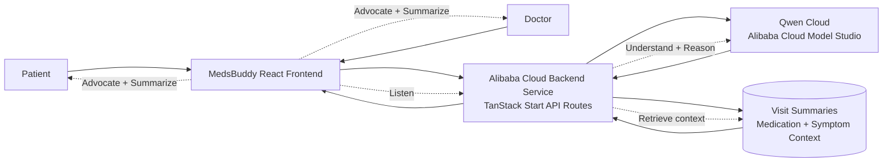

# MedsBuddy AI

MedsBuddy AI is a Qwen Cloud-powered AI patient advocate for doctor visits. With patient consent, it listens to the visit, understands patient and doctor intent, retrieves relevant patient history and medication context, speaks up when clarification is needed, and automatically generates structured visit documentation, follow-up actions, and plain-language summaries.

## Qwen Cloud Hackathon Submission

- **Track:** Track 4: Autopilot Agent
- **Title:** MedsBuddy: AI Patient Advocate for Doctor Visits
- **Agent loop:** Listen -> Understand -> Reason -> Retrieve patient information -> Help the doctor -> Summarize
- **Primary workflow:** Doctor Visit / AI Patient Advocate mode

See `docs/DEVPOST_SUBMISSION.md` for the copy-paste Devpost pitch, demo video script, judging map, and submission checklist.

## Hackathon Architecture



The same diagram is available as `docs/architecture.mmd`.

## Qwen Cloud Integration

The app no longer uses Featherless AI. All AI chat calls now go through the backend client in `src/lib/qwen-cloud.ts`, which calls the Qwen Cloud OpenAI-compatible chat completions API.

Important proof files:

- `src/lib/qwen-cloud.ts` - Qwen Cloud API client.
- `src/lib/ai-chat.functions.ts` - MedsBuddy AI server function using Qwen Cloud.
- `src/routes/api/qwen-proof.ts` - backend proof endpoint for judges.
- `docs/HACKATHON_QWEN_CLOUD_PROOF.md` - copy-pasteable proof call and request shape.

## Environment Variables

Copy `.env.example` to `.env.local` for local development:

```bash
cp .env.example .env.local
```

Set at least one Qwen/DashScope API key variable:

```bash
QWEN_API_KEY=your_qwen_cloud_key
# or
DASHSCOPE_API_KEY=your_dashscope_key
```

Supported variables:

| Variable             | Required         | Description                                                                                                                                             |
| -------------------- | ---------------- | ------------------------------------------------------------------------------------------------------------------------------------------------------- |
| `QWEN_API_KEY`       | Yes              | Qwen Cloud API key. `DASHSCOPE_API_KEY` also works.                                                                                                     |
| `DASHSCOPE_API_KEY`  | Yes, alternative | DashScope API key alias.                                                                                                                                |
| `QWEN_MODEL`         | No               | Defaults to `qwen-plus`.                                                                                                                                |
| `QWEN_API_BASE_URL`  | No               | Defaults to `https://dashscope-intl.aliyuncs.com/compatible-mode/v1`. Change this if your Alibaba Cloud account uses another DashScope region endpoint. |
| `TAVILY_API_KEY`     | No               | Enables optional web search context for medical questions.                                                                                              |
| `ELEVENLABS_API_KEY` | No               | Enables optional speech-to-text and text-to-speech for Doctor Visit voice.                                                                              |
| `DATABASE_PROVIDER`  | No               | Defaults to `local-browser-store`; use this to document a future Alibaba Cloud database target.                                                         |
| `DATABASE_URL`       | No               | Optional database connection string for a future ApsaraDB-backed persistence layer.                                                                     |

## Run Locally

Install dependencies:

```bash
npm install
```

Start the local dev server:

```bash
npm run dev
```

Open the app at `http://localhost:5173`.

Check the backend health endpoint:

```bash
curl -sS http://localhost:5173/api/health
```

Run the Qwen Cloud proof endpoint:

```bash
curl -sS -X POST http://localhost:5173/api/qwen-proof \
  -H "Content-Type: application/json" \
  -d '{"prompt":"Explain how MedsBuddy helps a patient prepare for a doctor visit."}'
```

## Build

```bash
npm run build
npm run start
```

The production service listens on `PORT`, defaulting to `3000` in the provided Dockerfile.

## Deploy on Alibaba Cloud

The project can be deployed as a containerized backend/frontend service on Alibaba Cloud Elastic Compute Service, Container Registry plus Container Service for Kubernetes, or Serverless App Engine.

1. Create an Alibaba Cloud Model Studio / DashScope API key.
2. Build and push the container image:

```bash
docker build -t medsbuddy-ai .
```

3. Deploy the image to your Alibaba Cloud service.
4. Configure runtime environment variables:

```bash
QWEN_API_KEY=your_qwen_cloud_key
QWEN_MODEL=qwen-plus
QWEN_API_BASE_URL=https://dashscope-intl.aliyuncs.com/compatible-mode/v1
PORT=3000
```

5. After deployment, verify:

```bash
curl -sS https://your-service-domain.example/api/health
curl -sS -X POST https://your-service-domain.example/api/qwen-proof \
  -H "Content-Type: application/json" \
  -d '{"prompt":"Say hello from Qwen Cloud."}'
```

## Public Submission Checklist

- Qwen Cloud replaces Featherless AI.
- API keys are read from environment variables only.
- Backend API routes are included for health and Qwen proof.
- Dockerfile is included for Alibaba Cloud container deployment.
- Architecture diagram is included.
- MIT license is included.

## License

MIT
